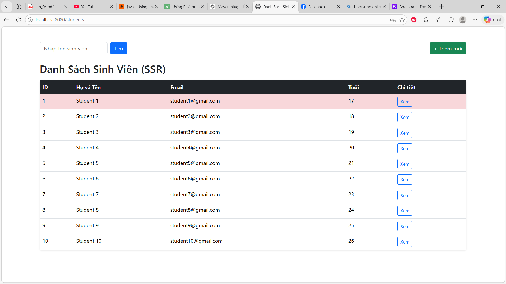
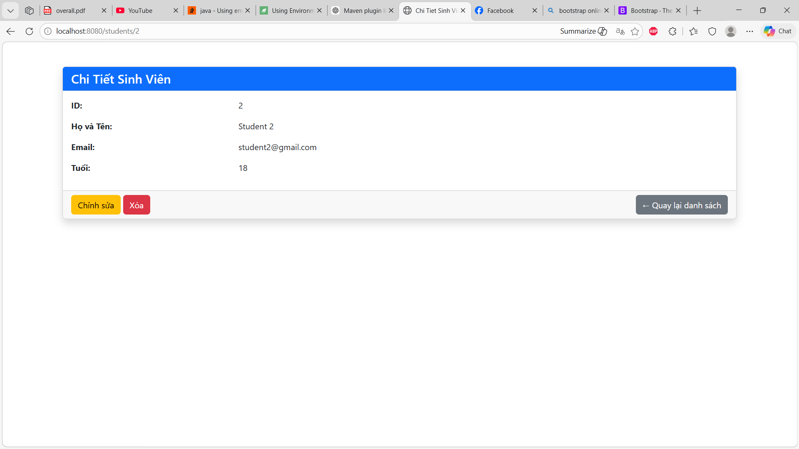
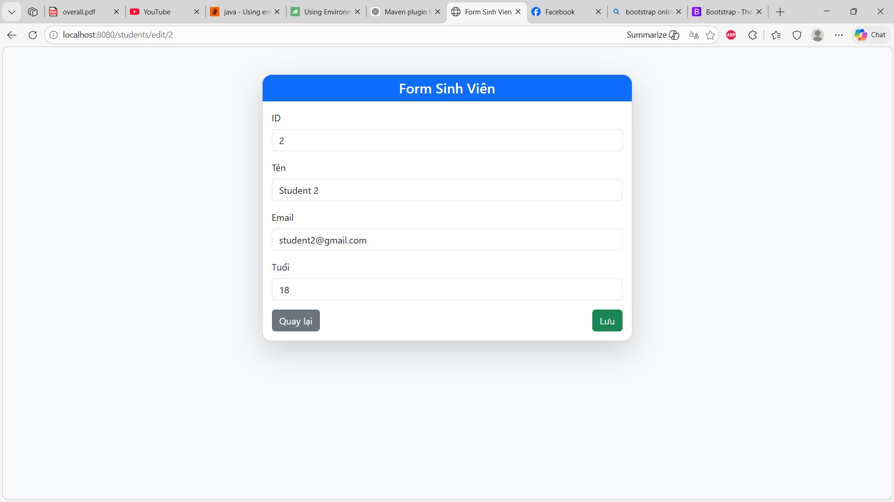

# Lab CNPMNC
### Danh sách nhóm:
Trần Uy - 2213897

#### Link web:
https://student-management-h8r9.onrender.com

#### Link github:
https://github.com/uyaware/student_management


### Lab 1:
##### 1. Quan sát thông báo lỗi: UNIQUE constraint failed. Tại sao Database lại chặn thao tác này?
```sql
INSERT INTO students VALUES (1, 'Tran Uy', 'tranuyqhc1@gmail.com', 22);
```
```
Execution finished with errors.
Result: UNIQUE constraint failed: students.id
At line 22:
INSERT INTO students VALUES (1, 'Tran Uy', 'tranuyqhc1@gmail.com', 22);
```
- Tại vì khóa chính phải khác nhau (và không được null) để giúp phân biệt được giữa các record.

##### 2. Database có báo lỗi không? Từ đó suy nghĩ xem sự thiếu chặt chẽ này ảnh hưởng gì khi code Java đọc dữ liệu lên?
khi code Java đọc dữ liệu lên?
```sql
INSERT INTO students (id, email, age) VALUES (11, 'tranuyqhc1@gmail.com', 22);
```
```
Execution finished without errors.
Result: query executed successfully. Took 1ms, 1 rows affected
At line 22:
INSERT INTO students (id, email, age) VALUES (11, 'tranuyqhc1@gmail.com', 22);
```
- Database không báo lỗi vì không khai báo NOT NULL ở cột name. 
- Sau này nếu đọc dữ liệu cột name và dùng những hàm như toUpperCase thì sẽ bị lỗi.

##### 3. Tại sao mỗi lần tắt ứng dụng và chạy lại, dữ liệu cũ trong Database lại bị mất hết?
- Do cấu hình *"spring.jpa.hibernate.ddl-auto=create"* khiến mỗi lần app start phải drop bảng cũ và tạo lại bảng mới, dẫn đến mất dữ liệu.

### Hình ảnh các module lab 4:

#### 1. Module danh sách student:


#### 2. Module thông tin chi tiết của student:


#### 3. Module chỉnh sửa thông của student:
